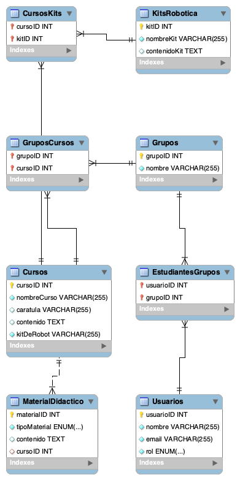

# Actividad 7: Sistema de Gestión de Robótica

## Descripción del proyecto

Este proyecto tiene como objetivo desarrollar un sistema de gestión para una institución educativa dedicada a la robótica. El sistema permite registrar usuarios, gestionar kits de robótica y cursos, así como asignar roles a los usuarios (administrativos, profesores y estudiantes). Además, el sistema permite la creación de relaciones entre las entidades y proporciona datos falsos para realizar pruebas.

## Funcionalidades

- **Registro de usuarios**: Permite registrar tres tipos de usuarios: Administrador, Profesor y Estudiante.
- **Gestión de kits de robótica**: Incluye información sobre kits disponibles para los cursos.
- **Gestión de cursos**: Registro de cursos relacionados con robótica.
- **Relaciones entre tablas**: Los usuarios tienen un grupo asignado y los cursos están relacionados con los kits de robótica.

## Diagrama ER

El diagrama ER muestra las entidades principales del sistema: **Usuarios**, **Grupos**, **Kits de Robótica**, **Cursos** y sus relaciones.
